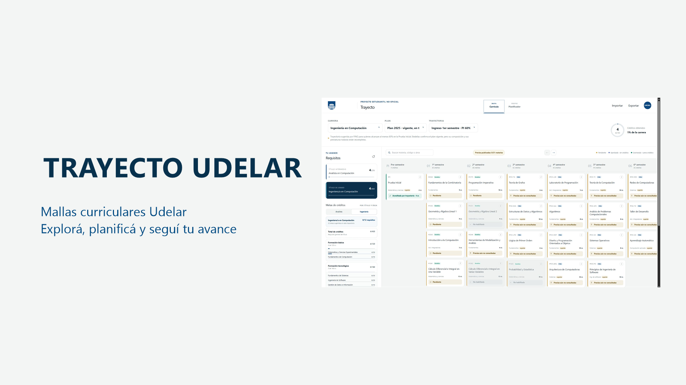

# Trayecto Udelar



> La carrera puede ser flexible. Entender cómo recorrerla no debería ser una materia más.

[Abrir Trayecto](https://trayecto-udelar-piloto.tokyo121.chatgpt.site/) · [Reportar un dato incorrecto](https://github.com/elios11/trayecto-udelar/issues) · [Seguridad](SECURITY.md)

## Un mapa para una universidad enorme

Trayecto nació de una idea bastante simple: que estudiantes de toda la Udelar tengan un lugar centralizado, amigable y fácil de entender para explorar su carrera y pensar los próximos semestres.

Las herramientas que conocíamos estaban hechas principalmente para Ingeniería y, más específicamente, para Computación. Eran muy útiles, pero dejaban afuera a mucha gente. Si una malla interactiva ayuda a entender previas, créditos y caminos posibles, ¿por qué ese privilegio tendría que depender de la facultad en la que estudiás?

La meta es construir una **currícula universal de Udelar**: no una trayectoria rígida ni una máquina que decida por vos, sino un mapa que te ayude a hacer mejores preguntas y conversar con más claridad con Bedelía, la Comisión de Carrera y otras personas estudiantes.

## ¿Qué podés hacer?

- Explorar materias por semestre sin descifrar una tabla pensada para imprimir en 2007.
- Marcar cursos aprobados y materias exoneradas.
- Ver créditos totales, mínimos por área y requisitos de títulos cuando existen fuentes oficiales suficientes.
- Entender qué te falta para habilitar un curso o examen.
- Buscar optativas y electivas sin perder las que ya marcaste.
- Armar distintos escenarios en el planificador y compartirlos mediante una exportación, sin modificar la currícula oficial.
- Usarlo cómodamente desde computadora, tablet o celular y elegir el tema visual que mejor te resulte.

## Si acabás de entrar a Udelar

No necesitás conocer todas las siglas ni tener resuelta la carrera completa. Elegí facultad, carrera, plan y sede; después podés recorrer la malla y abrir cada materia para ver sus detalles.

En Trayecto, **aprobada** significa que aprobaste el curso, mientras que **exonerada** representa que completaste también la evaluación final correspondiente. Por eso los créditos se suman al exonerar. Esta distinción permite evaluar por separado las previas de curso y de examen que publica Bedelías.

Tu avance, preferencias y planificación se guardan en el navegador. Actualmente no hay cuentas ni una base de datos con información de estudiantes. Si cambiás de dispositivo o borrás los datos del navegador, usá las opciones de exportar e importar para conservar tu progreso.

## ¿Los datos son oficiales?

Trayecto es un **proyecto estudiantil no oficial**. Bedelías, planes de estudio, resoluciones, sitios institucionales, EVA y otras publicaciones de Udelar son las fuentes; Trayecto las reúne, normaliza y presenta de una forma más cómoda.

La interfaz diferencia datos verificados, trayectorias sugeridas, planes históricos y casos todavía parciales. No inventamos una previa o un crédito para llenar un hueco: si la fuente no alcanza, preferimos mostrar la limitación. Para tomar decisiones académicas importantes, confirmá siempre con tu Bedelía o Comisión de Carrera.

Udelar tiene muchas carreras, sedes, planes y excepciones. La cobertura seguirá creciendo y puede haber errores. Si encontrás uno, contanos qué carrera y plan estabas mirando y, si podés, enlazá la fuente institucional correspondiente. Nunca adjuntes una exportación real de tu progreso a un issue público.

## Compartir también es parte del plan

Una de las motivaciones del proyecto es que planificar no sea una actividad solitaria. Podés preparar un escenario semestral, exportarlo y pasárselo a una amistad para comparar ideas, pedir una opinión o coordinar materias en común.

La planificación compartida es una propuesta personal: no cambia previas, créditos, áreas ni reglas oficiales. Pensalo como compartir un mapa con anotaciones, no como inscribirte a cursos.

## Colaborar

Hay varias formas de ayudar, incluso si es tu primer año o no programás:

- avisar que una materia, crédito, sede o previa cambió;
- acercar un plan, resolución o trayectoria publicada por Udelar;
- contar qué parte de la interfaz resulta confusa;
- probar la experiencia con teclado, lector de pantalla o celular;
- proponer mejoras y, si te animás, abrir un pull request.

Antes de trabajar con datos curriculares, revisá [PROJECT_CONTEXT.md](PROJECT_CONTEXT.md) y [docs/bedelias-importer.md](docs/bedelias-importer.md). Una web estudiantil puede ayudarnos a detectar un faltante, pero una afirmación académica necesita respaldo institucional.

## Desarrollo local

Requiere Node.js `>=22.13.0` y npm.

```bash
git clone https://github.com/elios11/trayecto-udelar.git
cd trayecto-udelar
npm ci
npm run dev
```

Para verificar y generar un artefacto portable:

```bash
npm run security:repo
npm run verify
npm run build
npm run package
node scripts/package-portable-build.mjs --verify
```

La compilación no depende de ChatGPT Sites. La guía para reconstruir y mover el proyecto a otro proveedor está en [docs/portable-build.md](docs/portable-build.md), y los controles del repositorio público están en [docs/security-public-repository.md](docs/security-public-repository.md).

## Licencia

El repositorio es visible públicamente, pero todavía no tiene una licencia de código abierto. Hasta que se elija una, su publicación no concede automáticamente permiso para copiar, redistribuir o reutilizar el código.

---

Hecho desde Uruguay, con cariño por la educación pública y con la esperanza de que elegir el próximo semestre dé un poquito menos de vértigo.
